# Movies_ETL
In this analysis, we were asked to help to create an automated pipeline that takes in new data, performs the appropriate transformations, and loads the data into existing tables. We refactored existing code from to create one function that takes in the three files—Wikipedia data, Kaggle metadata, and the MovieLens rating data—and performs the ETL process by adding the data to a PostgreSQL database.

## Overview of the analysis: 

We were asked ot create 4 Deliverables for this analysis: 

- **Deliverable 1**: Write an ETL Function to Read Three Data Files - Using knowledge of Python, Pandas, the ETL process, and code refactoring, write a function that reads in the three data files and creates three separate DataFrames.

- **Deliverable 2**: Extract and Transform the Wikipedia Data - Using knowledge of Python, Pandas, the ETL process, and code refactoring, extract and transform the Wikipedia data so you can merge it with the Kaggle metadata. While extracting the IMDb IDs using a regular expression string and dropping duplicates, use a try-except block to catch errors.

- **Deliverable 3**: Extract and Transform the Kaggle data - Using knowledge of Python, Pandas, the ETL process, and code refactoring, extract and transform the Kaggle metadata and MovieLens rating data, then convert the transformed data into separate DataFrames. Then, merge the Kaggle metadata DataFrame with the Wikipedia movies DataFrame to create the movies_df DataFrame. Finally, merge the MovieLens rating data DataFrame with the movies_df DataFrame to create the movies_with_ratings_df.

- **Deliverable 4**: Create the Movie Database - Use knowledge of Python, Pandas, the ETL process, code refactoring, and PostgreSQL to add the movies_df DataFrame and MovieLens rating CSV data to a SQL database.

## Results: 

- **Deliverable 1**:
  - The function converts the Wikipedia JSON file to a Pandas DataFrame, and the DataFrame is displayed in the ETL_function_test.ipynb file.
  
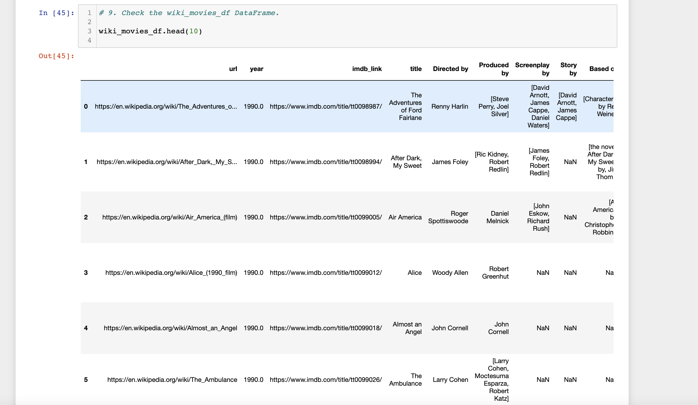
  
  - The function converts the Kaggle metadata file to a Pandas DataFrame, and the DataFrame is displayed in the ETL_function_test.ipynb file.
  
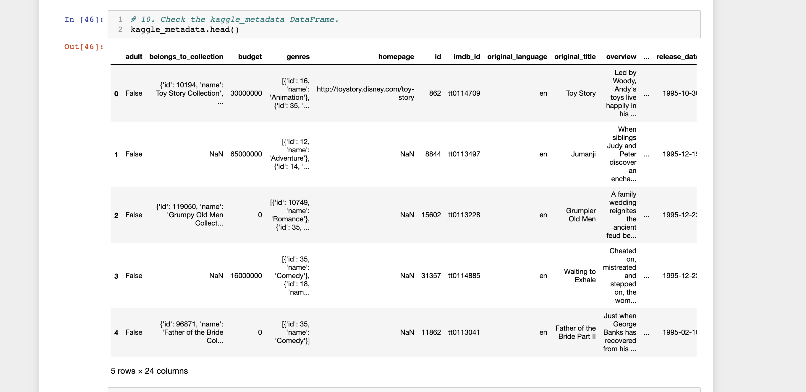 
 
  - The function converts the MovieLens ratings data file to a Pandas DataFrame, and the DataFrame is displayed in the ETL_function_test.ipynb file.

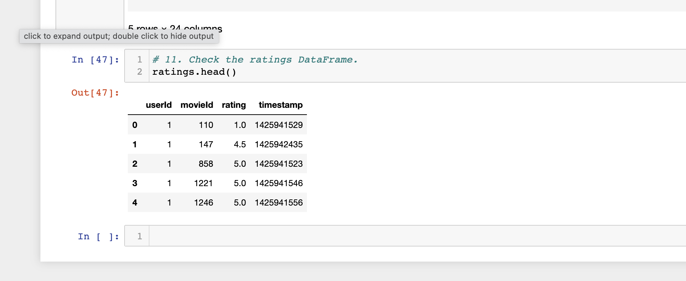 

- **Deliverable 2**: 
  - The cleaned Wikipedia data is converted to a Pandas DataFrame, and the DataFrame is displayed in the ETL_clean_wiki_movies.ipynb file.
  - 
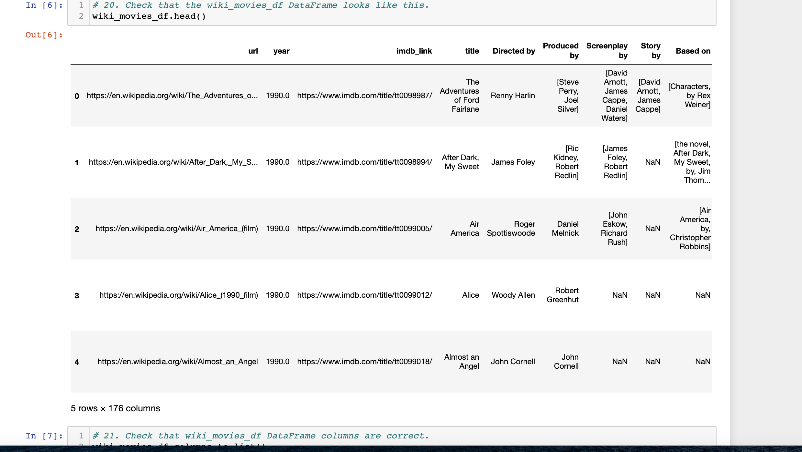 
 
 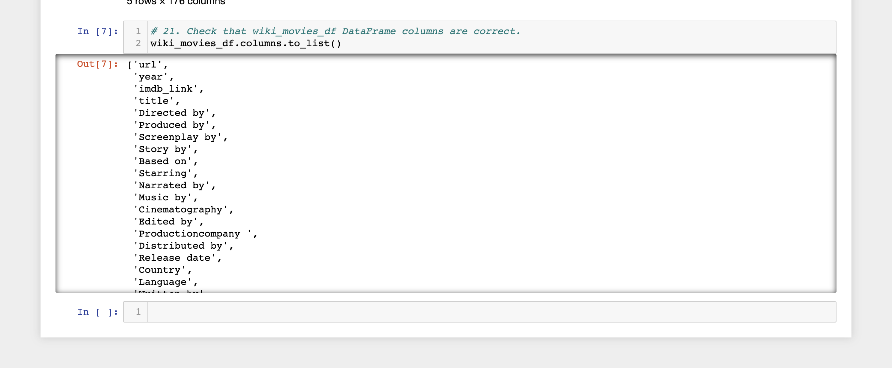 

- **Deliverable 3**: 
  - The movies_df DataFrame is merged with the cleaned ratings DataFrame to create the movies_with_ratings_df DataFrame. 
  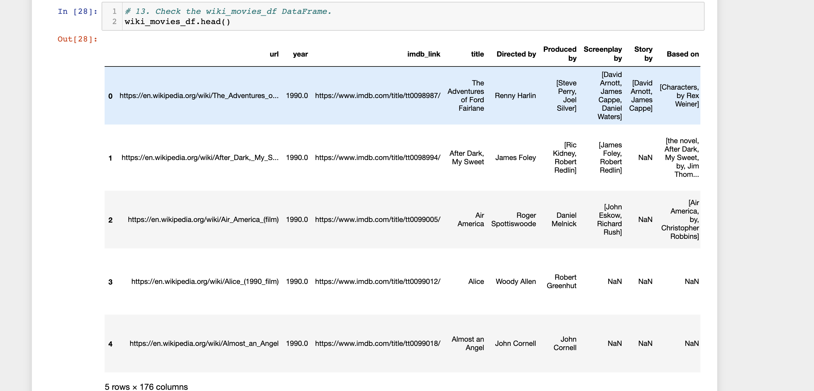 
  
  - The movies_with_ratings_df and the movies_df DataFrames are displayed in the ETL_clean_kaggle_data.ipynb file.

 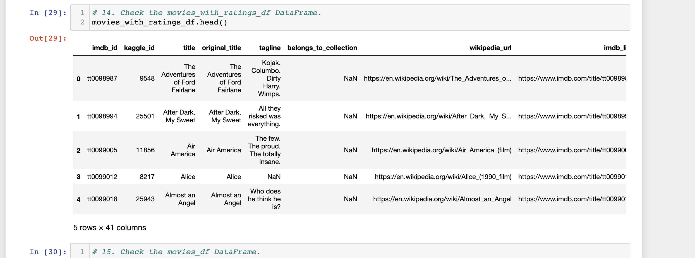 
 
  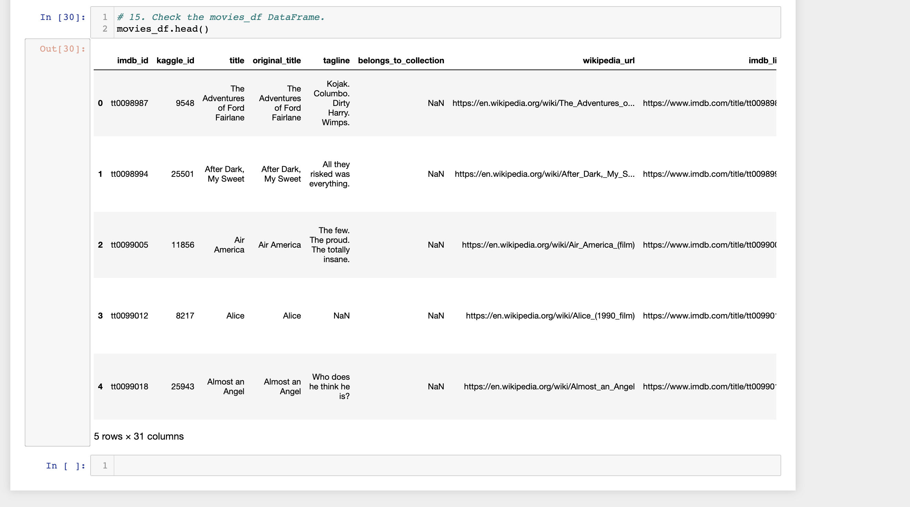 

- **Deliverable 4**:
  - The data from the movies_df DataFrame replaces the current data in the movies table in the SQL database, as determined by the movies_query.png.
  
 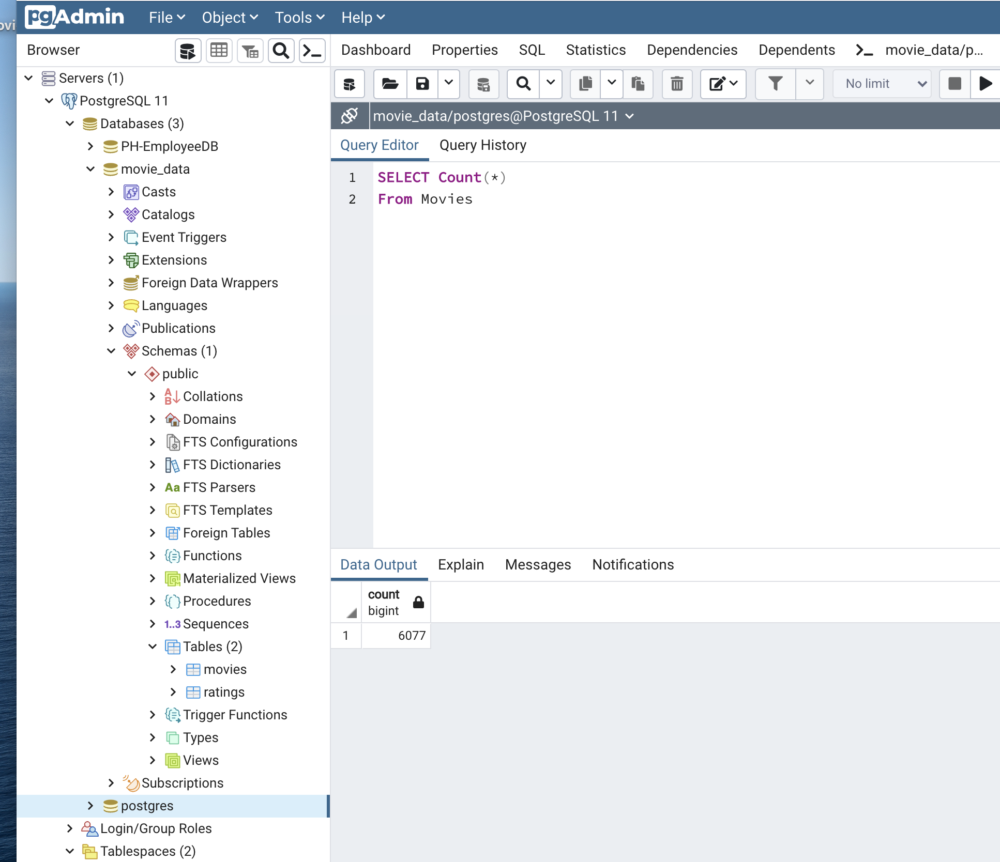 
  
  - The data from the MovieLens rating CSV file is added to the ratings table in the SQL database, as determined by the ratings_query.png.
  
  - The elapsed time to add the data to the database is displayed in the ETL_create_database.ipynb file. 

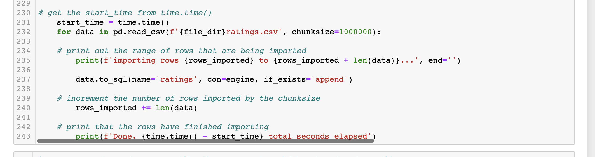  

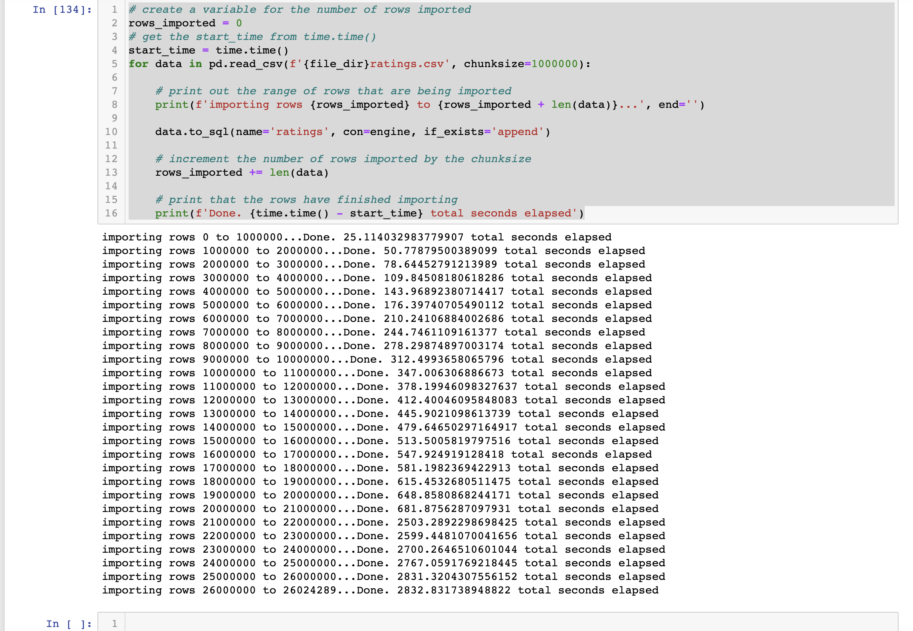 

